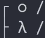

# 관계형 db

- 항목이 정해져 있음
- 데이터를 엑셀처럼 표에 저장
- 데이터 입출력시 SQL이라는 언어를 사용하고 미리 스키마 정의(표만들기)도 해야하고 데이터 중복저장을 피하기 위해 정규화해야함
- 안정적인 데이터저장과 운영이 필요한 곳에서 사용

# 비관계형 db

- 오브젝트 형태로 저장함(array처럼)
- 분산처리를 잘해줌(대용량 트래픽 분산처리 : SNS 서비스처럼 많은 데이터 입출력이 필요할때 강점)
- 몽고디비에서 무료 호스팅 사용하기
- SQL 언어, 스키마 정의(표 만들기), 정규화 이런게 대부분 필요없음

# MongoDB (비관계형 db)

- 데이터를 자바스크립트 object자료형과 똑같은 모양으로 저장
- 500mb 정도 용량의 무료 호스팅 <mongodb.com>, free로 선택후 aws로 선택, 국가는 서울로 선택한다.

    1. MongoDB 저장방식
        - collection 생성 -> document 생성 -> 데이터 기록
        - 게시판(collection)이라는 큰 폴더안에 리스트(document) 하나하나가 도큐먼트가 되고 그안에 항목들이 데이터가 된다고 이해함
        - 몽고디비 crud 배우기 (😊crud : 기본적인 데이터 처리 기능인 Create(생성), Read(읽기), Update(갱신), Delete(삭제) 를 묶어서 일컫는 말)

    2. Security > Database Access
        - db 접속용 아이디와 비밀번호 만드는 곳
    3. Security > Network Access
        - db 접속가능한 ip로 설정 - 개발할경우 안전한 ip 추가
    4. DEPLOYMENT > Database > Browse Collections >Collections 에서 db를 확인 할 수 있음
    5. Add My Own Data -> 데이터베이스 만들기
    6. 데이터 베이스는 하나의 홈페이지라고 보면됨 - 큰사이트는 여러개 가질수도 있음
    7. 컬렉션으로 게시판을 만들거니까 post라고 적음(하나의 폴더라구 생각하기)
    8. Insert Document 클릭 하여 도큐먼트 만들기

# MongoDB 데이터 가져오기
1. 몽고디비 설치 (npm i mongodb)
2. mongodb 접속하기 app > page.tsx 에 적으면 커넥트가 계속 일어나서 서버에 부하가 온다. 따라서 서버 띄울때 1번만 실행 시켜야한다.
    - 루트에 util 폴더 생성후 database.js 파일 생성 > 그안에 코드 적기
    - 이코드는 외부에 노출되어서는 안돼므로 환경변수로 관리
3. DEPLOYMENT > Database > connect > Connect to your application > application code 에서 주는 주소 복사
4. 2안에 주소에 넣고 디비 비밀번호 적어주기
5. 필요한 부분에 2에서 export한 ```connectDB ``` 가져다 쓰기
    - 몽고디비는 await를 붙여야하므로 function 에 async 를 꼭 써 주어야 한다.

# 게시판 기능 개발하기

1. 글목록 조회
    - db에서 조회하여 리스트로 뿌려주기
2. 상세페이지
3. 글발행기능
    - 글쓰기를 누르고 작성한 글을 db에 저장하기
    - 글작성시 고려사항 체크 (빈파일이나 악성코드등을 보낼수도 있으므로 db로 바로 저장하는것이 아닌 중간 프로그램(서버)에서 검사하여 통과한 것만 db로 저장 시켜야 위험하지 않음 = 3-tier architecture = 3티어 아키텍쳐)
    - 서버에 글을 저장하라고 요청 -> 서버에서 검사하고 db에 저장
4. 수정기능
    - 리스트마다 수정삭제 버튼 추가(클릭시 수정페이지로 이동)
    - 수정페이지의 경우 db에 있는 글로 채워있게 하기
    - 수정완료할 경우 db에 있는 글 수정하기(updateOne)
5. 삭제기능
    - 

# 서버기능 만들기

* 서버 개발자(서버에 요청시에 코드실행)
    > url과 method가 필요함
    # method
    - get : 유저에게 데이터 전송시
    - post : 새로운 데이터 추가시
    - put : 데이터 수정시 (patch보다 더 많이 사용)
    - delete : 데이터 삭제시
    - patch : 데이터 수정시

* 서버기능 만들기(api)
    1. app > api 폴더를 만들기 (신버전이라 잘안됌)
    2. pages > api 폴더를 만들기 (현재 프로젝트는 이렇게 진행)


# npm run build



라우트에서

- 첫번째 동그라미 모양 : 스태틱 랜더링 (디폴트값)
- 두번째 람다모양 : 다이나믹 랜더링 (```getServerSession```을 쓰면 모든페이지가 람다일수 있음)

> 
    - λ  (Server)  server-side renders at runtime (uses getInitialProps or getServerSideProps)
    - ○  (Static)  automatically rendered as static HTML (uses no initial props)

+ list 페이지 같은 경우는 새로 글을 쓸때마다 그려줘야 하므로 다이나믹 랜더링이 이루어 져야한다.
+ ```npm run start``` 를 사용하면 실제 배포된 형태를 볼 수 있는대 리스트에 글을 써도 바로 올라오지 않음
+ ```npm run build``` 때 보여준 코드만 보여준다. 따라서 다이나믹 랜더링으로 바꾸어 주어야함.(예약어 ```dynamic``` 사용)

* 다이나믹 랜더링 단점 : 서버 / db 부담이 큼 -> 캐싱기능 사용가능
* 캐싱: 페이지 완성본을 잠깐 저장하고 재사용하는것 (get 요청 결과도 캐싱기능이 가능하다.)

# env

- 환경변수를 만들때 ```NEXT_PUBLIC_ ``` 를 붙여서 만들어 주어야 적용됨

> generateBuildId가 달라져서 오류 해결
<https://nextjs.org/docs/app/api-reference/next-config-js/generateBuildId>

# 회원기능

1. 브라우저 쿠키에 사용자 정보를 저장하여 로그인시 서버에 보냄
    1. session : 세션 id만 저장되어있음
        - 장점 : 유저의 get / post 요청마다 로그인 상태 체크가 가능하다
        - 단점 : db 조회를 많이해야 해서 부담 (단점을 보완하기 위해 세션 id 보관용 db인 redis를 사용(입출력이 빠름))
    2. token : 보통 JSON WEB TOKEN(JWT) 방식을 말하며 짧은 문자로 암호화 한다.
        - 장점 : db 조회가 없어서 유저가 많거나 마이크로서비스(서버가 많은 경우) 운영중이면 편하다.
        - 단점 : 토큰을 누군가 가져가서 사용할 경우 강제 로그아웃등이 불가능하다.
    3. OAuth (오어쓰) : a사이트의 있는 회원정보를 b사이트에서도 사용 할 수 있다. (= 소셜로그인)
        - a사이트에 있는 정보를 jwt만들어서 사용하거나 session으로 db에 저장해서 사용한다.
        - nextjs의 경우  ```NextAuth.js``` 또는 ```Auth.js``` 라이브러리를 설치하여 사용한다.
            > 아이디/ 비번로그인시  jwt 사용해야함(개발자가 직접 아이디/비번을 취급하면 보안상 문제가 생길 수 있기 때문이다.)
            > DB adapter 기능을 이용하면 DB에 session을 저장해두고 유저 관리도 가능하다.
            > 아이디 비번관리가 필요없으면 코드 짤것도없음
    4. DB adapter 사용(session 방식으로 회원기능을 만들고 싶을 때)
    - 첫로그인시 자동회원가입(DB에 보관)
    - 로그인시 자동으로 유저가 언제 로그인했는지 세션정보를 DB에 보관
    - 서버에서 지금 로그인된 유저정보가 필요하면 JWT가 아니라 DB에 있던 세션정보를 조회해서 가져온다.
    - 로그아웃시 유저 세션정보는 db에서 삭제 된다.
    - 가입된 유저정보를 DB에 저장하는게 필요하거나 유저 로그인상태를 엄격하게 관리하고 싶으면 DB adapter 기능을 사용한다.

        1. ```npm install @auth/mongodb-adapter mongodb ``` 설치  <https://authjs.dev/reference/adapter/mongodb> 참조👀 (몽고디비 4버전이상)
        2.  ```[...nextauth].ts``` 에 mongodb-adapter 셋팅
            > redis같은 것들 쓰면 데이터 저장시 하드말고 램을 사용하기 때문에 빨라서 session 방식 구현할 때 인기있다. 
        3. 세팅 후 로그인을 하면 몽고 db에 test라는 폴더가 생성된다.
            > 하위 sessions 폴더를 확인 하면 현재 로그인한 유저 세션 정보가 저장되어 있다.
            > 하위 accounts 폴더에는 가입된 유저의 계정 정보가 들어가 있다.
            > 하위 users 폴더에는 가입된 유저 정보가 들어가 있다.
            > 위처럼 나뉘어져 있는 이유는 하나의 유저가 여러 계정을 가질 수 있기 때문이다. 따라서 accounts에는 가입된 계정정보가 모두 뜨고 users에는 유저정보 1명만 뜨게 된다.
            > test라는 폴더에 저장되는 것이 보기 싫고  다른 이름의 database에 넣고 싶으면 MongoDB 접속 URL에 ```mongodb.net/?``` 에서 물음표 앞에 ```mongodb.net/forum?``` 식으로 database 이름을 넣으면 된다. 


# 깃허브 소셜로그인 만들기
1. 깃허브 로그인 후 세팅 ->  Developer settings -> OAuth apps 만들기
2. 로컬에서 개발중인 사이트 주소 적기 -> 추후 개발완료 후 개발완료 된 주소로 변경해야 한다.
3. 클라이언트 id와 패스워드 따로 적어두기
4. ```npm i next-auth``` 설치
5. ```pages/api/auth``` 폴더 생성 후  ```[...nextauth].ts``` 파일생성